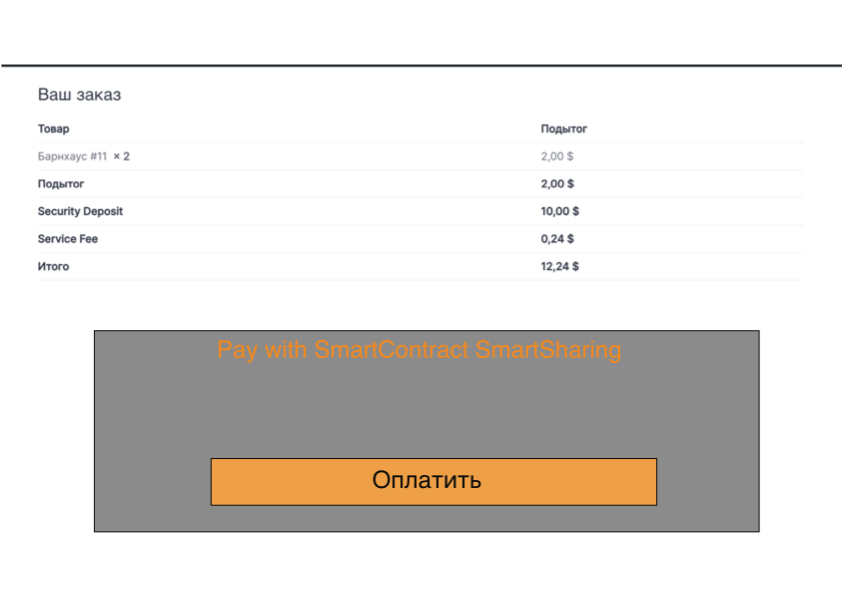
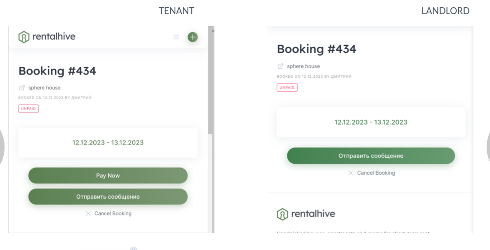
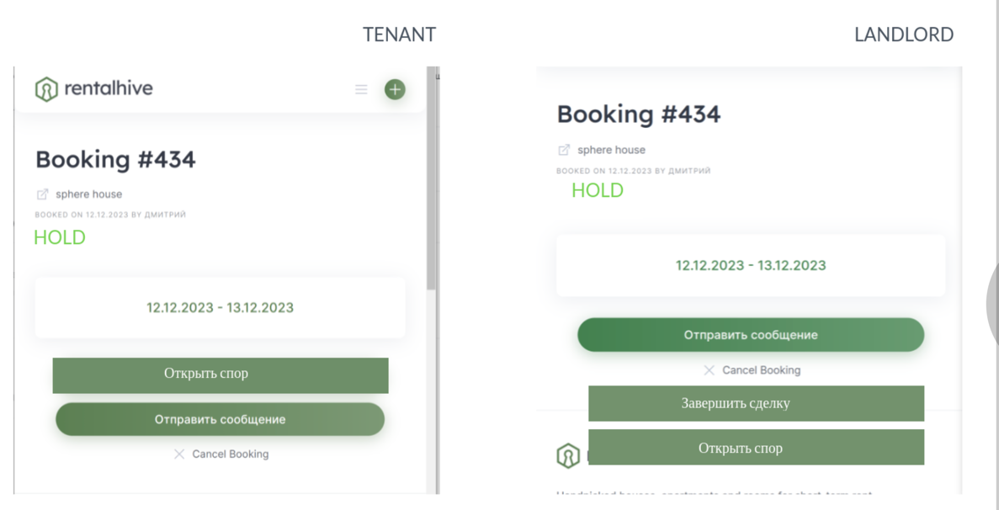
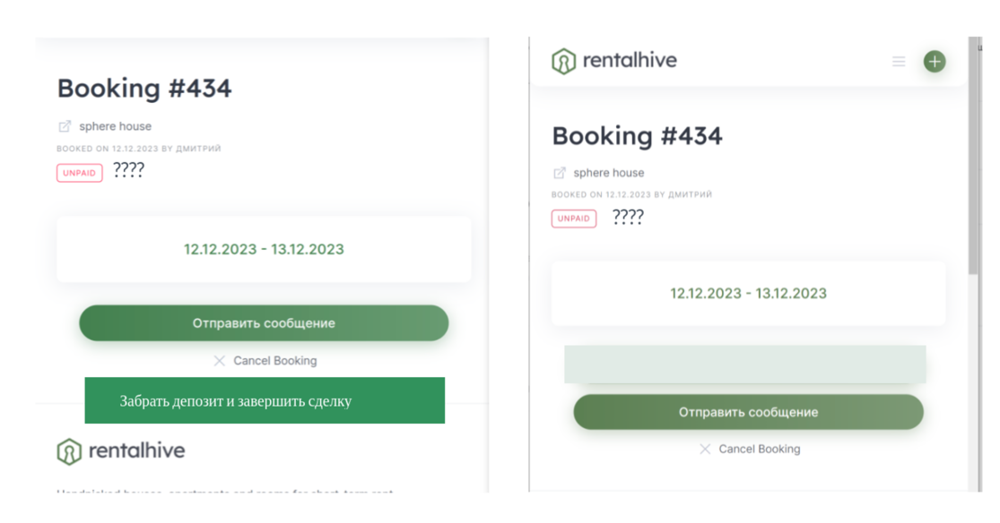

#Написание плагина способа оплаты для Rentalhive + WooCommerce

1. ##кнопка оплатить, как на картинке
 

При нажатии кнопки происходит открытие новой вкладки у пользователя по адресу https://pay.smartsharing.com?order_id=12345&action=start

2. ##Добавить отображения статуса в разделе бронирования и кнопок соответствующих статусу и роли (арендатор, арендодатель)
- статус UNPAID:
   -  
     - У арендатора кнопка pay now, при нажатии которой создается заказ woocomerce и далее 1 пункт
- статус HOLD:
  -  
    - У арендатора кнопка "открыть спор" (на данный момент должна быть disabled). 
    - У арендодателя кнопка "открыть спор" (на данный момент должна быть disabled) и кнопка "Завершить сделку", при нажатии на которую происходит открытие новой вкладки у пользователя по адресу https://pay.smartsharing.com?order_id=12345&action=approve
- cтатус LANDLORD_APPROVED
  - 
    - У арендатора кнопка "Забрать депозит и звершить сделку", при нажатии на которую происходит открытие новой вкладки у пользователя по адресу https://pay.smartsharing.com?order_id=12345&action=finish
3. ##Плагин слушает сообщения в rabbitmq и записывает в базу данных для ордера доп данные (либо своя отдельная таблица, связанныа с ордером) такие как "contract", "tenant", "arbiter", "feeReceiver", "nonce", "dealHash", "state", "txHash", "time". Связь ордера и транзакции происходит через "extra".
4. ##При получении ивента, актуализировать статус у ордера и бронирования

Пример сообщения из rabbitmq
```json
{"level":"info","service":"chain-listener","chain":"bsc_testnet","event":{"kind":"SmartSharingStateChanged","chainId":97,"chainType":"ETH","blockNumber":37126800,"txIndex":4,"logIndex":9,"txHash":"0x7aae6f82ecfcd030517f3171d6ab956faa234c287fd00c1a66f62255a00aa2cb","contract":"0xcc4D255D9F70127414D1A09b921670cCC4361bac","deal":{"token":"0x39242e4CE1143a105D050FB8e86072dDcce8D4a5","tenant":"0x9e42983BD6beBf08d9a823cEB40b01cB6bc9c608","landlord":"0xbc110DF81E3d26cab8ED6F90548C03391E2392fE","arbiter":"0xB8f7FD2E7603F29270A1dcb49347284aaAAF46bC","feeReceiver":"0xB8f7FD2E7603F29270A1dcb49347284aaAAF46bC","deposit":"100000000","renta":"10000000","tenantFee":"1000000","landlordFee":"1000000","nonce":"4","extra":"6f726465725f69643a2035313100000000000000000000000000000000000000"},"dealHash":"0xa33b73150d930712e85e1fd8a53ae728e2dfb7b8e2bbc3609f5c19669665a289","state":1,"prevState":0,"creator":"0x9e42983BD6beBf08d9a823cEB40b01cB6bc9c608"},"time":1706090289,"message":"sending event"}
```

Пример расшифровки "extra" для Python: 
``` python
web3.Web3.to_text("0x6f726465725f69643a2035313100000000000000000000000000000000000000".rstrip("0"))
```
результат: ```'order_id: 511'```